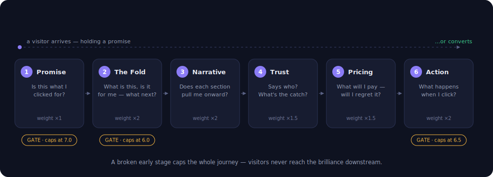
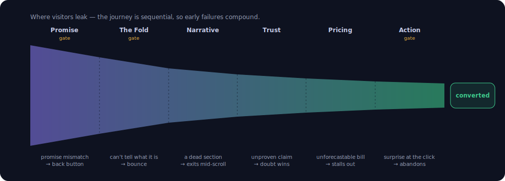
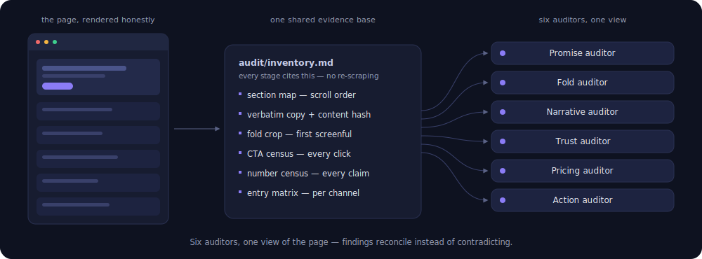
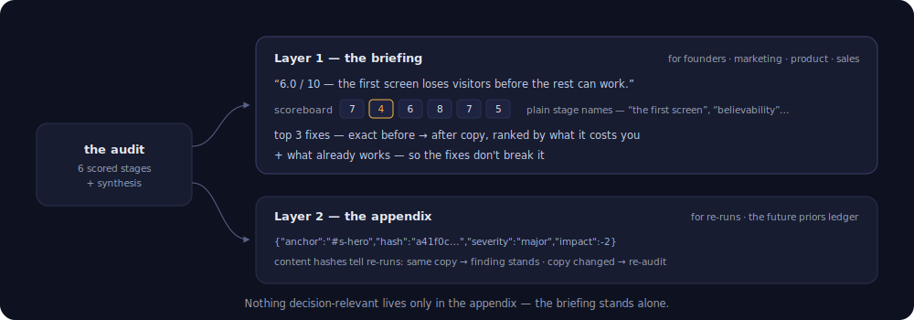
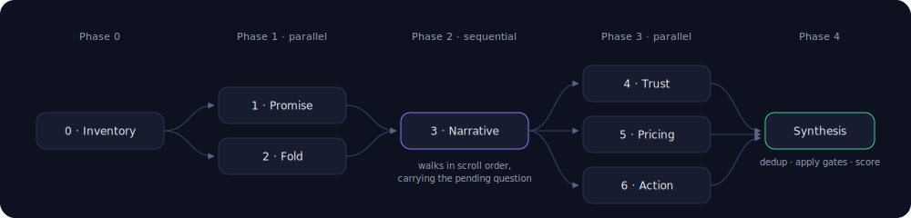

# stranger-test

**Would a stranger convert? Six questions every visitor asks — and a scored
audit of whether your site answers them, stage by stage, with exactly where
you lose them.**

Most site critiques are a single opinionated pass: one prompt, one wall of
feedback, different every time you run it. `stranger-test` replaces that
with an instrument. It audits your site the way a visitor actually
experiences it — as a sequence of questions, each of which is answered or
not in seconds — and scores each stage 0–10 against anchored rubrics
grounded in the economists, psychologists, and practitioners who did the
original work: Kahneman & Tversky, Thaler, Ariely, Simonson, Hermann Simon,
Krug, the Heaths, Sugarman, Schwartz, Fogg, Cialdini, Pirolli & Card,
Hopkins, Caples, Ogilvy, NN/g, Baymard. Every reference file cites its
sources so your team can go read them — and
[**docs/methodology.md**](docs/methodology.md) documents how each source
became a check: the source → mechanism → falsifiable-check → weight chain,
what counts as admissible evidence, and how the weights, bands, and gate
values were set.

What you get from a run: **a defensible read on how likely a visitor is to
make it through** — plus the exact copy changes, ranked by what each one
costs you, written in plain language your whole team can act on.

<p align="center">
  
</p>

## The journey model

Visitors don't experience a site as a feature list; they experience it as a
sequence of questions. Each stage audits the page against the question the
visitor is holding at that moment:

| Stage | Skill | The visitor's question |
|---|---|---|
| 1 · The Promise | `clarity-promise` | "Is this what I clicked for?" — message match, information scent |
| 2 · Above the Fold | `clarity-fold` | The 5-second abandon-or-scroll verdict + the scroll-cue check (a fold that looks "complete" invites exit) |
| 3 · Narrative Continuity | `clarity-narrative` | Changes every section — each one must answer the pending question and plant the next; anything else is an exit ramp |
| 4 · The Trust Layer | `clarity-trust` | "Says who?" — proof proximity, specificity, risk reversal |
| 5 · The Pricing Page | `clarity-pricing` | "What does it cost me, and will I regret it?" — anchoring, unit legibility, the 8-failure catalog |
| 6 · The Point of Action | `clarity-action` | "What happens when I click?" — Fogg's B=MAP, interaction cost, surprise audit |

**Where this sits in the customer lifecycle.** Lifecycle funnels
(awareness → activation → retention) describe the journey as the *company*
observes it; this audit models it as the *visitor* perceives it — a sequence
of questions, not funnel states. It covers the segment a page can win or
lose: from the entry click (the awareness→activation handoff — the entry
matrix audits message match per channel, unfurl card included) through
interest and intent to first experienced value (the action stage walks past
the CTA to value, not just past the form). Upstream positioning and channel
strategy, and downstream retention mechanics, have no page to inventory —
but the audit guards their seams: message match protects the handoff in;
pricing predictability and commitment honesty protect the relationship
after.

## Where conversions are won and lost

The journey is sequential, which is why the audit's arithmetic has
**gates**: a visitor who bounces at the first screen never sees your
brilliant pricing page, so no amount of downstream quality can buy back an
upstream failure. Every stage is a leak point with a characteristic failure
mode — and the audit names which one is costing you the most.

<p align="center">
  
</p>

A failed 5-second test caps the journey score at 6.0, a primary-entry
message mismatch at 7.0, a broken primary CTA at 6.5 — no matter how good
everything else is. The arithmetic encodes the sequence: **a gate binding
is always your first fix**, because nothing downstream of a gate matters to
the visitors who never pass it.

## One evidence base, six auditors

Stage 0 (`clarity-inventory`) renders the page honestly and builds the
single shared view every auditor cites — section map, verbatim copy with
content hashes, fold crop, CTA census, number census, and the per-channel
entry matrix. Six auditors scraping independently would produce six
slightly different pages and findings that can't be reconciled; one
inventory means every finding quotes the same evidence and deduplicates
cleanly at synthesis.

<p align="center">
  
</p>

## What makes the scores definitive

- **Anchored bands** — each SKILL.md defines behaviorally what a 3, a 6,
  and a 9 *are* ("a stranger states what/who/next from the fold crop
  alone"), so scoring is classification, not vibes.
- **Evidence or it doesn't exist** — every finding quotes the copy or names
  the element; unfalsifiable findings are rejected at synthesis.
- **Gates, not just points** — a failed 5-second test caps the journey
  score at 6.0 no matter how good the pricing page is, because the visitor
  never gets there. The arithmetic encodes the journey's sequence.
- **Ledger-ready findings** — every finding is emitted as structured JSON
  (anchor, content hash, direction, severity, score impact), so future runs
  can re-verify prior findings instead of re-deriving them. That ledger
  exists: [priors](https://github.com/modiqo/priors) — see
  [Iterating with your team](#iterating-with-your-team-stranger-test--priors).
- **Doctrine suppression** — the audit reads the site's own design laws
  first and never recommends against them. Its job is to make the site the
  best version of *itself*, not to regress it toward the industry's mean
  (no reflexive "add a testimonial carousel").
- **The fabrication line** — the audit never advises inventing proof.
  Missing evidence yields "instrument, then state", never a fake number.

How all of this was constructed — the admission rules for sources, the
translation chain from literature to check, and why the weights and gate
values are what they are — is documented in
[docs/methodology.md](docs/methodology.md).

## Install

### Claude Code

```bash
claude plugin marketplace add modiqo/stranger-test
claude plugin install stranger-test@stranger-test-marketplace
```

The same commands work inside Claude Code when entered as slash commands.
The command registers as `/stranger-test`; the stage skills keep their
`clarity-*` prefix — they are the clarity checks inside the instrument.

### Codex and other agent harnesses

```bash
git clone https://github.com/modiqo/stranger-test
cd stranger-test
./install.sh
```

| Harness | Integration |
|---|---|
| **Claude Code** | Native plugin (above), or the generic installer |
| **Codex** | Paste [`adapters/AGENTS-snippet.md`](adapters/AGENTS-snippet.md) into your project's `AGENTS.md`, pointed at the clone |
| **OpenClaw** | Stage skills installed by `install.sh` |
| **Kimi CLI** and other Agent-Skills harnesses | Point them at `skills/` |

The instrument is plain markdown — a conductor command plus seven stage
skills — so any harness that can read files can run it; the rubrics, bands,
and gates are identical everywhere.

Skills work best with browser tools available (Claude in Chrome, or any
browser MCP) so the fold, scroll cues, and CTA walks can be *verified*.
Without a browser the audit still runs in `--fast` mode from fetched copy,
and every finding that would need eyes is marked UNVERIFIED.

## Use

```
/stranger-test https://example.com        # full six-stage audit
/stranger-test #/pricing --stage 5        # one stage against a route
/stranger-test --fast                     # no-browser mode (copy-only; visual checks marked UNVERIFIED)
```

Individual stages can also be invoked directly as skills (`clarity-fold`,
`clarity-pricing`, …) — each is self-contained once an inventory exists.

## Interpreting the report

The report has two layers, because its readers are founders, marketing,
product, and sales — not auditors.

<p align="center">
  
</p>

**Layer 1, the briefing**, is plain language and stands alone: the verdict
(one score, the biggest problem in business terms, the fix that pays most),
a six-row scoreboard with plain-language stage names ("The first screen",
"Believability", "The signup moment"), the top-3 fixes as before → after
rewrites, and what's already working (so fixes don't break it). No rubric
vocabulary appears there — the instrument holds its own output to its own
curse-of-knowledge rule. **Layer 2, the appendix**, is the machine layer
for tracking over time: structured findings, scores' arithmetic, content
hashes. Everything below explains Layer 2:

**Scores (0–10 per stage).** Scores are classifications against the
behavioral bands in each SKILL.md, not impressions — a Fold 9 *means* "a
stranger states what/who/next correctly from the first screenful alone."
When a score surprises you, read the band it cites; disagree with the band,
not the number.

**The journey score and its gates.** The journey score is a weighted mean
(Fold, Narrative, and Action count double) — but **gates override
arithmetic**: a failed 5-second test caps the journey at 6.0, a
primary-entry message mismatch at 7.0, a broken primary CTA at 6.5. A
capped report says so explicitly ("capped by Fold gate; uncapped would be
7.9"). A gate binding is always your first fix — nothing downstream of a
gate matters to the visitors who never pass it.

**Findings.** Every finding is structured:

```json
{"stage": 4, "anchor": "#s-proof", "anchor_hash": "a41f0c…",
 "finding": "one falsifiable sentence",
 "evidence": "the exact copy quoted",
 "advice": "one concrete change",
 "direction": "proof-adjacent",
 "severity": "gate | major | minor", "score_impact": -2}
```

- `anchor` + `anchor_hash` — where it lives, and a hash of that section's
  copy so a future run can tell "same copy, finding stands" from "copy
  changed, re-audit". Keep these if you track findings over time.
- `evidence` — findings with no quoted evidence were already rejected
  before you saw the report; everything you see is falsifiable.
- `direction` — the way the advice pushes (`terser`, `proof-earlier`…).
  If two findings across runs push opposite directions on the same anchor,
  that's a tradeoff for *you* to decide once — not a defect to fix twice.
- `severity` — `gate` findings cap the journey score; `major` costs ≥1
  point; `minor` is worth fixing when you're in the file anyway.
- `score_impact` — exactly what the finding costs; the arithmetic of every
  score is reconstructible from its findings.

**Two guarantees.** *Doctrine suppression*: the audit reads your site's own
design laws first and never recommends against them — it makes your site
the best version of itself, not the industry's mean. *The fabrication
line*: it will never advise inventing proof; missing evidence yields
"instrument, then state," never a fake number.

## Iterating with your team (stranger-test + priors)

An audit is rarely a one-shot event. The real workflow looks like this:
you're a designer, you run the audit on Monday and fix the top three
findings. Then feedback arrives all week, in every shape feedback actually
arrives — the founder records a two-minute Loom, sales forwards a call
transcript where a prospect got confused by the pricing page, the PM leaves
comments in Slack, and someone pushes back on one of your fixes ("the terse
headline is intentional — leave it").

The naive loop is painful: paste all of that into a fresh session and
re-run. The agent audits from scratch, re-discovers issues you already
fixed, re-raises the suggestion your team already rejected (worded slightly
differently, so it feels new), and hands you a different wall of feedback
than last time. Every run starts at zero; the team's judgment lives in
chat scrollback.

[**priors**](https://github.com/modiqo/priors) closes that loop. It keeps a
small append-only ledger next to your project of everything a run *settled*
— findings, fixes, and human decisions — and makes the next run honor it
before saying anything new. Run the audit through it:

```
/with-priors stranger-test https://example.com
```

and three things change:

- **Feedback becomes ledger entries, not paste-ins.** Anything tokenizable
  is feedback: a video transcript, a sales-call recording, a Slack thread,
  review comments, meeting notes. Drop it into the run and the decisions
  inside it are recorded once — "sharp corners are intentional" becomes a
  standing decision every future audit must honor, not a thing you re-explain
  each session.
- **Fixes are verified, not re-found.** stranger-test findings carry an
  anchor and a content hash, so the next run can tell "same copy — finding
  carried" from "copy changed — re-audited, and it's fixed." You get credit
  for the work you did.
- **Rejected advice stays rejected.** Once a human says no, the ledger's
  keeper mechanically refuses the same suggestion on unchanged copy —
  the agent can't re-litigate it just because it sampled a different
  opinion today. Reversing a decision becomes an explicit question, never
  fresh unsolicited advice.

So instead of a new wall of feedback, a re-run opens with the delta:

```text
Checked against 21 priors:
  ✓ 9 fixed — nice work
  → 7 carried — same copy, same findings
  ? 2 need your call (sales transcript conflicts with the "terse headline" decision)
New this run: 3
```

Repeated audits converge instead of oscillating — and the whole team's
judgment compounds, whichever medium it arrived in. The two projects are
built for each other but ship independently: stranger-test emits
ledger-ready findings; [priors](https://github.com/modiqo/priors) works
with any judgment skill.

## Orchestration

Stages 1–2 run in parallel (both consume the top of the page), stage 3 runs
strictly sequentially (it carries the visitor's pending-question state
through the scroll), stages 4–6 run in parallel, then a synthesis pass
dedups cross-stage findings and applies the gates. `commands/
stranger-test.md` is the conductor.

<p align="center">
  
</p>

## Roadmap

- **The priors ledger — shipped**, as its own system:
  [modiqo/priors](https://github.com/modiqo/priors). Findings with identity
  and lifecycle (open / fixed / accepted-tradeoff / regressed),
  re-verify-before-re-discover, and content-hash-scoped forgetting.
  Compose them today with `/with-priors stranger-test <url>` — see
  [Iterating with your team](#iterating-with-your-team-stranger-test--priors).
- **v2 — native ledger emission**: the synthesis pass proposes its findings
  to the priors keeper directly (no wrapper), and direction-conflict
  escalation lands as a first-class "your call" item.

## License

MIT
